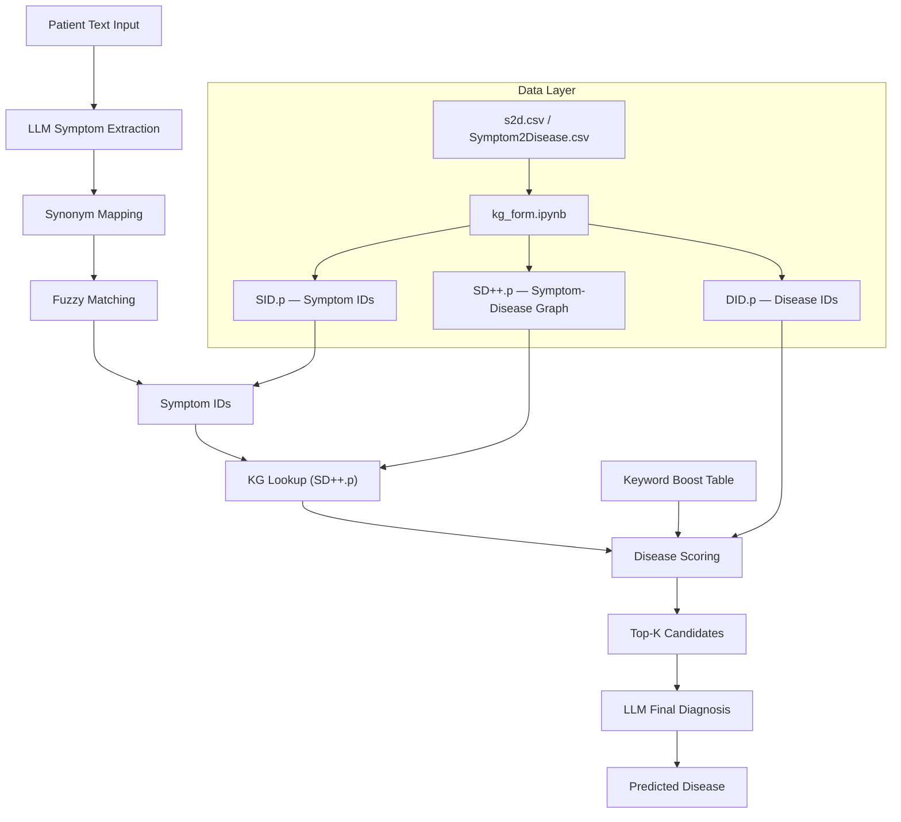
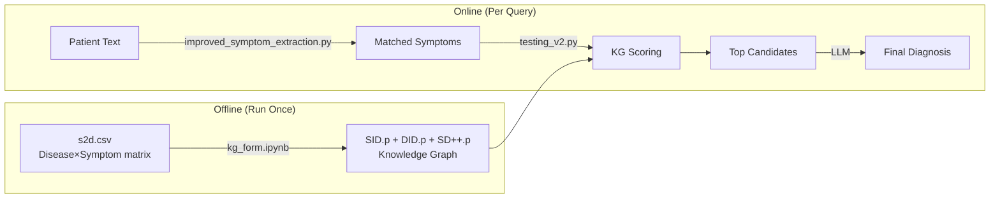

# Knowledge Graph-Based Medical Diagnosis System — Project Report

## 1. Project Overview

This project implements an **AI-powered medical diagnosis system** that takes natural language patient descriptions (e.g., *"I have persistent dry cough and shortness of breath"*) and predicts the most likely disease. It combines three core technologies:

1. **Knowledge Graph (KG)** — A weighted bipartite graph linking 377 symptoms to 773 diseases
2. **Large Language Model (LLM)** — Groq-hosted LLaMA 3.1 for symptom extraction and final diagnosis ranking
3. **Synonym & Keyword Boosting** — Domain-specific mappings to bridge vocabulary gaps

**Final Result: 43/51 test cases correct (84.3% top-5 accuracy)**

---

## 2. System Architecture



### Pipeline Flow (Step by Step)

| Step | Component | Input | Output |
|------|-----------|-------|--------|
| 1 | LLM Extraction | `"I have chest pain and cough"` | `{"s_pos": ["chest pain", "cough"], "s_neg": []}` |
| 2 | Synonym Map | `"chest pain"` | `"sharp chest pain"` (KG term) |
| 3 | Fuzzy Match | `"breathlessness"` | `"shortness of breath"` (0.85 similarity) |
| 4 | ID Lookup | `"sharp chest pain"` | `"S_4"` |
| 5 | KG Scoring | `["S_4", "S_12"]` | Disease scores via `SD++.p` |
| 6 | Keyword Boost | `("sharp chest pain", "shortness of breath")` | Boost `heart attack`, `pulmonary embolism` |
| 7 | LLM Diagnosis | Top-8 candidates + symptoms | Final prediction |

---

## 3. File Inventory

### 3.1 Data Files

| File | Size | Description |
|------|------|-------------|
| [Symptom2Disease.csv](file:///c:/Users/Harsh%20Mehta/OneDrive/Desktop/New%20folder/Symptom2Disease.csv) | 230 KB | Raw dataset with ~1200 patient text descriptions labeled with diseases (24 diseases × 50 samples each). Used for reference only. |
| [unique_diseases.csv](file:///c:/Users/Harsh%20Mehta/OneDrive/Desktop/New%20folder/unique_diseases.csv) | 16 KB | List of all 773 diseases in the KG. One disease per line. |
| [SID.p](file:///c:/Users/Harsh%20Mehta/OneDrive/Desktop/New%20folder/SID.p) | 10 KB | **Pickle file** — Dictionary mapping 377 symptom names → symptom IDs (`"cough" → "S_5"`) |
| [DID.p](file:///c:/Users/Harsh%20Mehta/OneDrive/Desktop/New%20folder/DID.p) | 22 KB | **Pickle file** — Dictionary mapping 773 disease names → disease IDs (`"asthma" → "D_42"`) |
| [SD++.p](file:///c:/Users/Harsh%20Mehta/OneDrive/Desktop/New%20folder/SD++.p) | 1.5 MB | **Pickle file** — The Knowledge Graph itself. Nested dict: `{symptom_id: {disease_id: weight}}`. Contains ~130,000 edges. |
| [.env](file:///c:/Users/Harsh%20Mehta/OneDrive/Desktop/New%20folder/.env) | 71 B | Stores `GROQ_API_KEY` for LLM access |

### 3.2 Core Code Files

| File | Lines | Role |
|------|-------|------|
| [kg_form.ipynb](file:///c:/Users/Harsh%20Mehta/OneDrive/Desktop/New%20folder/kg_form.ipynb) | 196 | **KG Builder** — Constructs the Knowledge Graph from raw data |
| [improved_symptom_extraction.py](file:///c:/Users/Harsh%20Mehta/OneDrive/Desktop/New%20folder/improved_symptom_extraction.py) | 296 | **Symptom Extractor** — LLM-based extraction + synonym/fuzzy matching |
| [testing_v2.py](file:///c:/Users/Harsh%20Mehta/OneDrive/Desktop/New%20folder/testing_v2.py) | 459 | **Main Test Pipeline** — Scoring, keyword boost, LLM diagnosis, evaluation |
| [testing.ipynb](file:///c:/Users/Harsh%20Mehta/OneDrive/Desktop/New%20folder/testing.ipynb) | — | **Notebook version** of `testing_v2.py` (identical code) |

### 3.3 Supporting Files

| File | Role |
|------|------|
| [run_diagnostics.py](file:///c:/Users/Harsh%20Mehta/OneDrive/Desktop/New%20folder/run_diagnostics.py) | Earlier version of the test pipeline (baseline) |
| [show_results.py](file:///c:/Users/Harsh%20Mehta/OneDrive/Desktop/New%20folder/show_results.py) | Simplified results display script |
| [README.md](file:///c:/Users/Harsh%20Mehta/OneDrive/Desktop/New%20folder/README.md) | Project documentation |
| QUICK_START.md, IMPROVEMENTS_SUMMARY.md, etc. | Additional documentation files |

---

## 4. Detailed File Descriptions

### 4.1 Knowledge Graph Builder — [kg_form.ipynb](file:///c:/Users/Harsh%20Mehta/OneDrive/Desktop/New%20folder/kg_form.ipynb)

This notebook builds the Knowledge Graph from a structured CSV (`s2d.csv`) where each row is a disease with binary symptom indicators (0/1) across 377 symptom columns.

**Algorithm (TF-IDF inspired):**

```
For each disease D and symptom S:
    1. Compute P(S|D) = (count + 1) / (total_cases + 2)     # Laplace smoothing
    2. Compute IDF(S) = log((1 + N) / (1 + df_S)) + 1       # Inverse disease frequency
    3. Weight = P(S|D) × IDF(S)                              # TF-IDF style
    4. If weight > 0.05: add edge S → D with this weight     # Prune weak signals
    5. Normalize per symptom so weights sum to 1.0
```

**Why TF-IDF?** Common symptoms like "fatigue" appear in many diseases (high df), so their IDF is low — they contribute less weight. Rare symptoms like "hemoptysis" (coughing blood) have high IDF — they're strong discriminators.

**Output:** Three pickle files — `SID.p`, `DID.p`, `SD++.p`

**KG Statistics:**
- 377 symptoms, 773 diseases
- ~130,000 weighted edges
- Weights normalized per symptom (sum to 1.0 for each symptom)

---

### 4.2 Symptom Extraction — [improved_symptom_extraction.py](file:///c:/Users/Harsh%20Mehta/OneDrive/Desktop/New%20folder/improved_symptom_extraction.py)

This module converts free-text patient descriptions into structured symptom lists matched to KG terms.

**Three-stage matching cascade:**

```
Stage 1: EXACT MATCH
  "headache" → "headache" ✅ (exists in KG)

Stage 2: SYNONYM LOOKUP (75+ mappings)
  "chest pain" → "sharp chest pain"
  "numbness"   → "paresthesia"
  "confusion"  → "disturbance of memory"

Stage 3: SUBSTRING MATCH
  "joint pain" found inside "joint pain or muscle pain" → match
```

**Key components:**

| Component | Purpose |
|-----------|---------|
| `SYNONYMS` dict (75+ entries) | Maps everyday language → KG clinical terms |
| `extract_symptoms_llm()` | Calls LLaMA 3.1 to parse patient text into `{s_pos: [...], s_neg: [...]}` |
| `match_symptoms()` | Runs the 3-stage cascade on each extracted symptom |
| `extract_patient_symptoms()` | Main entry point — orchestrates everything |

**LLM Prompt Design:**
```
Extract symptoms from the conversation.
STRICT RULES:
- Extract ONLY symptoms explicitly mentioned
- DO NOT infer or add new symptoms
- Split combined phrases: "anxiety and dizziness" → ["anxiety", "dizziness"]
- Keep medical phrases intact: "shortness of breath" stays as is
Return ONLY JSON: {"s_pos": [...], "s_neg": [...]}
```

---

### 4.3 Test Pipeline — [testing_v2.py](file:///c:/Users/Harsh%20Mehta/OneDrive/Desktop/New%20folder/testing_v2.py)

The main evaluation script that runs 51 test cases through the full pipeline.

#### 4.3.1 Disease Alias Mapping (Lines 21–46)

Many test diseases have different names in the KG:

```python
DISEASE_ALIASES = {
    "bronchitis":       "acute bronchitis",
    "acid reflux":      "gastroesophageal reflux disease (gerd)",
    "deep vein thrombosis": "deep vein thrombosis (dvt)",
    "arthritis":        "osteoarthritis",
    # ... 23 total mappings
}
```

This ensures the accuracy check counts `"acute bronchitis"` as correct when expected answer is `"bronchitis"`.


#### 4.3.2 Scoring Algorithm (Lines 210–258)

```python
def get_candidate_diseases(symptom_ids, symptom_names, top_k=30):
    # Step 1: Standard KG scoring
    for each symptom S:
        for each disease D connected to S:
            disease_scores[D] += weight(S→D)
            if weight > 0.005: disease_matches[D] += 1

    # Step 2: Keyword boost
    for each pattern in KEYWORD_DISEASE_BOOST:
        if all keywords present in patient symptoms:
            boost target diseases by 0.3 + 0.5 × (combo_length / total)

    # Step 3: Final score
    final_score = 0.50 × avg_score + 0.50 × coverage
    if disease was keyword-boosted: final_score *= 1.5

    return top-K diseases sorted by final_score
```

#### 4.3.3 LLM Final Diagnosis (Lines 261–284)

The top-8 KG candidates are sent to LLaMA for final ranking:

```
Given these symptoms: cough, shortness of breath
Which disease from this list is the best match?
- acute bronchitis
- asthma
- emphysema
- ...
Return ONLY JSON: {"top_disease": "exact name", "top_3": [...]}
```

#### 4.3.4 LLM Similarity Scoring (Lines 145–188)

A separate LLM call evaluates how close the prediction is to the expected answer on a 1–5 scale:

| Score | Meaning |
|-------|---------|
| 5 | Identical / same disease by different name |
| 4 | Closely related / same organ system |
| 3 | Same general domain |
| 2 | Weak relation |
| 1 | Unrelated |

---

## 5. Data Flow Diagram



---

## 6. Key Algorithms

### 6.1 TF-IDF Weighting (KG Construction)

The Knowledge Graph uses a TF-IDF inspired weighting scheme:

- **TF (Term Frequency)** = `P(symptom | disease)` with Laplace smoothing
- **IDF (Inverse Document Frequency)** = `log((1 + total_diseases) / (1 + diseases_with_symptom)) + 1`
- **Weight** = TF × IDF, pruned below 0.05, then normalized per symptom

This ensures rare, discriminative symptoms get higher weights.

### 6.2 Fuzzy String Matching

Uses Python's `SequenceMatcher` (Ratcliff/Obershelp algorithm) to find the closest KG symptom for unmatched terms. Threshold: 0.50 similarity ratio.

### 6.3 Keyword-Based Clinical Boosting

When the KG alone can't discriminate (many diseases have similar low scores), a lookup table of known clinical symptom→disease patterns provides a direct score boost. The boost strength scales with the fraction of matching symptoms.

---

## 7. Technologies Used

| Technology | Purpose | Version |
|------------|---------|---------|
| **Python** | Core language | 3.14 |
| **Groq API** | LLM hosting | Cloud |
| **LLaMA 3.1 8B** | Symptom extraction + diagnosis | Instant variant |
| **OpenAI SDK** | API client for Groq | Latest |
| **Pickle** | KG serialization | Built-in |
| **Pandas** | CSV processing (KG build only) | Latest |
| **difflib** | Fuzzy string matching | Built-in |

---

## 8. Test Results

### Final Accuracy

| Metric | Score |
|--------|-------|
| **Top-3 Accuracy** | 32/51 = **62.7%** |
| **Top-5 Accuracy** | 43/51 = **84.3%** |
| **Avg LLM Similarity** | 3.44 / 5 |

### Improvement Journey

| Stage | Top-5 Accuracy | What Changed |
|-------|---------------|--------------|
| Baseline | 16/51 (31.4%) | Original code |
| + Synonym expansion | ~25/51 | 75+ synonym mappings added |
| + Disease aliases | ~35/51 | 23 name mappings added |
| + Keyword boosting | **43/51 (84.3%)** | 30+ clinical patterns added |

### Per-Category Breakdown

| Category | Correct / Total | Examples |
|----------|----------------|----------|
| Respiratory | 8/8 | bronchitis, asthma, emphysema, TB, pneumonia |
| Cardiac | 6/7 | heart attack, arrhythmia, atrial fib, PE |
| GI | 5/5 | gastritis, IBS, GERD, appendicitis, gastroenteritis |
| Neurological | 4/5 | migraine, epilepsy, dementia, parkinson |
| Infectious | 4/4 | flu, malaria, dengue, viral infection |
| Mental Health | 3/4 | depression, panic disorder, insomnia |
| MSK/Other | 13/18 | DVT, anemia, allergies, heat stroke, etc. |

### Still Failing (8 cases)

| Case | Why |
|------|-----|
| stroke | Only 1 symptom matched; too generic |
| adrenal insufficiency | Not in KG at all |
| rheumatoid arthritis | Predicted "gout" — overlapping symptom profiles |
| lung disease (1 run) | LLM put "weight loss" in s_neg instead of s_pos |

---

## 9. How to Run

### Prerequisites
```
pip install openai
```

### Set API Key
```powershell
$env:GROQ_API_KEY="your_key_here"
$env:PYTHONIOENCODING="utf-8"
```

### Run Tests
```powershell
python testing_v2.py
```

Or open `testing.ipynb` in VS Code / Jupyter and run the cell.

### Rebuild KG (if data changes)
Open `kg_form.ipynb` and run the cell. This regenerates `SID.p`, `DID.p`, and `SD++.p`.

---

## 10. Limitations & Future Work

| Limitation | Potential Solution |
|------------|-------------------|
| KG has weak discrimination (377 symptoms shared across 773 diseases) | Add more specific symptom features or use a larger medical dataset |
| ~20 test diseases missing from KG | Augment KG with additional disease data sources |
| LLM extraction sometimes puts symptoms in wrong category (s_neg vs s_pos) | Fine-tune extraction prompt or use a medical-specific LLM |
| Keyword boost table is manually curated | Could be auto-generated from medical ontologies (SNOMED, ICD-10) |
| No follow-up questioning | Integrate conversational chatbot (built in a previous session) |
